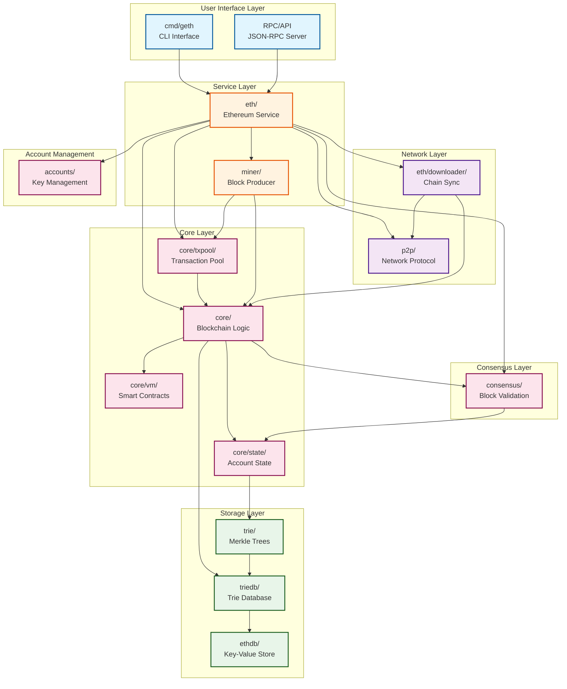

# 🔷 Go-Ethereum (Geth) - Main Components

> **Go-Ethereum** is the official Go implementation of the Ethereum protocol - a complete Ethereum node software.

## 📚 Core Components Overview

### 1. ⛓️ **Core** (`core/`)
**What it does:** The heart of the blockchain - handles all blockchain operations  
**Why it's needed:** Without this, there's no blockchain! It processes transactions, manages the state of all accounts, and maintains the chain of blocks.

Key parts:
- `blockchain.go` - Manages the chain of blocks
- `state/` - Tracks account balances and smart contract data
- `vm/` - Runs smart contract code (Ethereum Virtual Machine)
- `types/` - Defines transactions, blocks, receipts

---

### 2. 🌐 **Ethereum Protocol** (`eth/`)
**What it does:** Implements Ethereum's network protocol and peer communication  
**Why it's needed:** Allows your node to talk to other Ethereum nodes, sync the blockchain, and share transactions.

Key parts:
- `backend.go` - Main Ethereum service
- `downloader/` - Syncs blockchain from other nodes
- `protocols/` - Network communication protocols
- `filters/` - Event filtering for applications

---

### 3. 🤝 **Consensus** (`consensus/`)
**What it does:** Implements different consensus mechanisms (how nodes agree on the blockchain state)  
**Why it's needed:** Ensures all nodes agree on which blocks are valid and should be added to the chain.

Consensus types:
- `beacon/` - Proof of Stake (current Ethereum)
- `clique/` - Proof of Authority (test networks)
- `ethash/` - Proof of Work (legacy)

---

### 4. 💼 **Accounts** (`accounts/`)
**What it does:** Manages Ethereum accounts, keys, and wallets  
**Why it's needed:** Users need a secure way to store their private keys and sign transactions.

Features:
- `keystore/` - Encrypted key storage
- `usbwallet/` - Hardware wallet support (Ledger, Trezor)
- `abi/` - Smart contract interface handling

---

### 5. 🔗 **Peer-to-Peer Networking** (`p2p/`)
**What it does:** Low-level networking that connects nodes together  
**Why it's needed:** Creates the decentralized network by finding and connecting to other Ethereum nodes.

Key features:
- `discover/` - Finds other nodes on the network
- `nat/` - Handles firewalls and routers
- `rlpx/` - Encrypted communication protocol

---

### 6. 🌳 **Trie & TrieDB** (`trie/` & `triedb/`)
**What it does:** Implements Merkle Patricia Tries - special tree data structures  
**Why it's needed:** Efficiently stores and proves the state of all Ethereum accounts while allowing quick verification.

---

### 7. 💻 **Command Line Interface** (`cmd/`)
**What it does:** Provides the actual programs users run  
**Why it's needed:** Users need ways to interact with Ethereum!

Main commands:
- `geth/` - Main Ethereum node
- `clef/` - Secure transaction signer
- `evm/` - EVM testing tool
- `abigen/` - Go binding generator for smart contracts

---

### 8. 🔧 **RPC & APIs** (`rpc/` & `internal/ethapi/`)
**What it does:** Provides JSON-RPC APIs for external applications  
**Why it's needed:** Allows wallets, dapps, and other software to interact with your Ethereum node.

---

### 9. 💾 **Database** (`ethdb/`)
**What it does:** Storage layer for blockchain data  
**Why it's needed:** The blockchain data needs to be stored efficiently on disk.

Supported databases:
- LevelDB
- PebbleDB

---

### 10. ⚡ **Transaction Pool** (`core/txpool/`)
**What it does:** Manages pending transactions before they're included in blocks  
**Why it's needed:** Collects and prioritizes transactions from users waiting to be processed.

---

### 11. ⛏️ **Miner** (`miner/`)
**What it does:** Block production logic (for validators/miners)  
**Why it's needed:** Someone needs to create new blocks and include transactions!

---

### 12. 📊 **Metrics & Monitoring** (`metrics/`)
**What it does:** Collects performance and health statistics  
**Why it's needed:** Operators need to monitor their node's performance and health.

---

## 🏗️ Architecture Flow

```
User Request → RPC API → Ethereum Service → Transaction Pool
                                         ↓
                                    Consensus Engine
                                         ↓
                                    Blockchain Core
                                         ↓
                                    State Database
                                         ↓
                                    P2P Network → Other Nodes
```

## 🔀 Component Dependencies



### 📖 How to Read the Diagram

1. **Arrows show dependencies**: A → B means "A depends on B"
2. **Layers represent abstraction levels**: Higher layers depend on lower layers
3. **Colors indicate component types**:
   - 🔵 Blue: User interfaces
   - 🟠 Orange: Services
   - 🔴 Pink: Core logic
   - 🟢 Green: Storage
   - 🟣 Purple: Networking

### 🔑 Key Dependency Patterns

1. **The Ethereum Service (`eth/`) is the central coordinator** - almost everything connects through it
2. **Core components are independent** - they don't know about networking or APIs
3. **Storage is at the bottom** - everything ultimately stores data
4. **User interfaces are at the top** - they only talk to the service layer

---

## 🎯 In Simple Terms

Think of Geth as a complete Ethereum computer that:
1. **Stores** the entire history of Ethereum (blockchain)
2. **Validates** new transactions and blocks
3. **Communicates** with other Ethereum computers
4. **Executes** smart contracts
5. **Manages** user accounts and keys
6. **Provides** APIs for apps to interact with Ethereum

Each component has a specific job, and together they create a fully functional Ethereum node! 🚀